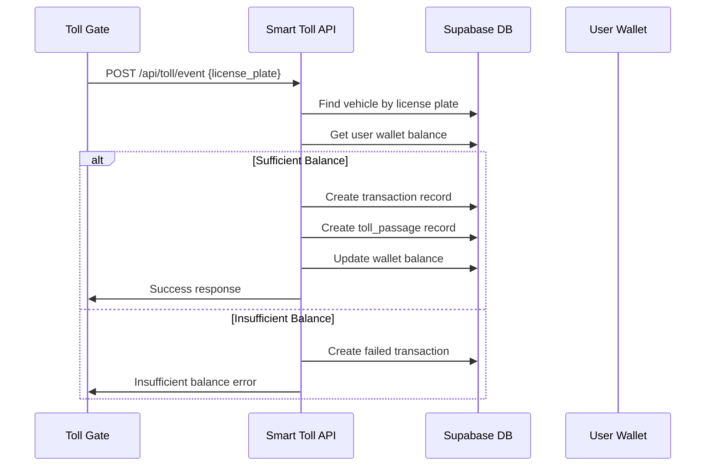
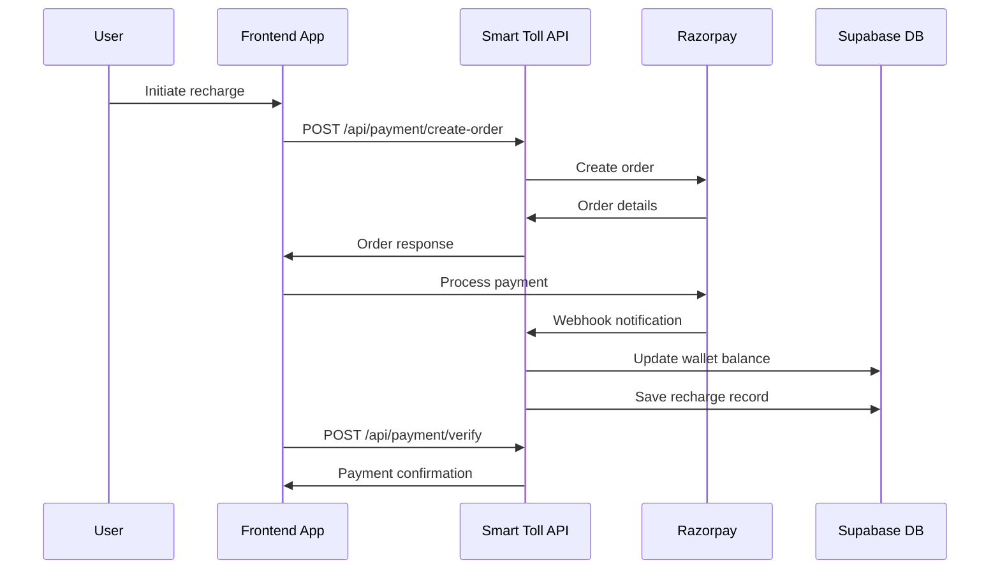

# Smart Toll Backend API

A comprehensive backend system for Smart Toll management with vehicle detection, automatic toll deduction, and integrated payment processing using Supabase as the database layer.

## 🚀 Features

- 🚗 **Vehicle Management**: Register and manage vehicles with license plates
- 💰 **Wallet System**: Digital wallet with automatic toll deductions
- 💳 **Payment Integration**: Razorpay integration for seamless recharges
- 🛣️ **Toll Gates**: Configurable toll gates with different pricing
- 🔐 **Authentication**: Secure JWT-based user authentication
- 📊 **Dashboard**: Real-time transaction monitoring and statistics
- 🔄 **Webhooks**: Automated payment confirmation via Razorpay webhooks
- 🌐 **Supabase Integration**: Modern database layer with real-time capabilities

## 🛠️ Tech Stack

- **Runtime**: Node.js with Express.js
- **Database**: Supabase (PostgreSQL with REST API)
- **Payment**: Razorpay Payment Gateway
- **Authentication**: JWT with bcryptjs
- **Validation**: Express Validator
- **Development**: Nodemon for hot reloading

## 📋 Prerequisites

- Node.js (v16 or higher)
- Supabase account and project
- Razorpay account (for payment processing)

## ⚡ Quick Start

### 1. Installation
```bash
cd backend
npm install
```

### 2. Environment Configuration
```bash
cp .env.example .env
```

Update `.env` with your configuration:
```env
# Database Configuration
DATABASE_URL=your_supabase_connection_string

# Supabase Configuration
SUPABASE_URL=https://your-project-ref.supabase.co
SUPABASE_ANON_KEY=your_anon_key
SUPABASE_SERVICE_ROLE_KEY=your_service_role_key

# JWT Configuration
JWT_SECRET=your-super-secret-jwt-key
JWT_EXPIRES_IN=7d

# Razorpay Configuration
RAZORPAY_KEY_ID=your_razorpay_key_id
RAZORPAY_KEY_SECRET=your_razorpay_key_secret
RAZORPAY_WEBHOOK_SECRET=your_webhook_secret

# Server Configuration
PORT=5000
NODE_ENV=development
FRONTEND_URL=http://localhost:5173
```

### 3. Database Setup
1. Run the schema creation script in [Supabase SQL Editor](https://supabase.com/dashboard/project/your-project/sql):
   ```bash
   # Copy and run supabase-schema.sql
   ```

2. Populate with mock data:
   ```bash
   # Copy and run mock-data.sql
   # Then run populate-transactions.sql
   ```

### 4. Start Development Server
```bash
npm run dev
```

The server will start on `http://localhost:5000`

## 📚 API Endpoints

### 🔐 Authentication

#### Register User
```http
POST /api/auth/register
```

**Request Body:**
```json
{
  "email": "user@example.com",
  "password": "SecurePass123!",
  "name": "John Doe",
  "phone": "+91-9876543210"
}
```

**Response:**
```json
{
  "success": true,
  "message": "User registered successfully",
  "data": {
    "user": {
      "id": "uuid",
      "email": "user@example.com",
      "name": "John Doe",
      "role": "user"
    },
    "token": "jwt_token_here"
  }
}
```

#### Login User
```http
POST /api/auth/login
```

**Request Body:**
```json
{
  "email": "user@example.com",
  "password": "SecurePass123!"
}
```

**Response:**
```json
{
  "success": true,
  "message": "Login successful",
  "data": {
    "user": {
      "id": "uuid",
      "email": "user@example.com",
      "name": "John Doe",
      "role": "user"
    },
    "token": "jwt_token_here"
  }
}
```

#### Get User Profile
```http
GET /api/auth/profile
Authorization: Bearer <jwt_token>
```

**Response:**
```json
{
  "success": true,
  "data": {
    "user": {
      "id": "uuid",
      "email": "user@example.com",
      "name": "John Doe",
      "phone": "+91-9876543210",
      "role": "user",
      "created_at": "2025-09-17T10:00:00Z"
    }
  }
}
```

### 💰 Wallet Management

#### Get Wallet Balance
```http
GET /api/wallet/balance
Authorization: Bearer <jwt_token>
```

**Response:**
```json
{
  "success": true,
  "data": {
    "balance": 1250.75,
    "currency": "INR"
  }
}
```

#### Get Transaction History
```http
GET /api/wallet/transactions?page=1&limit=10&type=toll_deduction
Authorization: Bearer <jwt_token>
```

**Query Parameters:**
- `page` (optional): Page number (default: 1)
- `limit` (optional): Items per page (default: 10, max: 50)
- `type` (optional): Transaction type filter (`toll_deduction`)

**Response:**
```json
{
  "success": true,
  "data": {
    "transactions": [
      {
        "id": "uuid",
        "amount": 75.00,
        "status": "completed",
        "transaction_type": "toll_deduction",
        "created_at": "2025-09-17T15:30:00Z",
        "toll_gate": {
          "name": "Mumbai-Pune Express Entry",
          "location": "Mumbai Entry Point"
        },
        "vehicle": {
          "license_plate": "MH01AB1234",
          "make": "Maruti",
          "model": "Swift"
        }
      }
    ],
    "pagination": {
      "page": 1,
      "limit": 10,
      "total": 25,
      "totalPages": 3
    }
  }
}
```

#### Add Vehicle to Account
```http
POST /api/wallet/add-vehicle
Authorization: Bearer <jwt_token>
```

**Request Body:**
```json
{
  "license_plate": "MH01AB1234",
  "vehicle_type": "car",
  "make": "Maruti",
  "model": "Swift",
  "year": 2020
}
```

**Response:**
```json
{
  "success": true,
  "message": "Vehicle added successfully",
  "data": {
    "vehicle": {
      "id": "uuid",
      "license_plate": "MH01AB1234",
      "vehicle_type": "car",
      "make": "Maruti",
      "model": "Swift",
      "year": 2020,
      "is_active": true
    }
  }
}
```

### 💳 Payment System

#### Create Payment Order
```http
POST /api/payment/create-order
Authorization: Bearer <jwt_token>
```

**Request Body:**
```json
{
  "amount": 1000.00,
  "currency": "INR"
}
```

**Response:**
```json
{
  "success": true,
  "data": {
    "order": {
      "id": "order_razorpay_id",
      "amount": 100000,
      "currency": "INR",
      "status": "created"
    },
    "key": "rzp_test_key_id"
  }
}
```

#### Verify Payment
```http
POST /api/payment/verify
Authorization: Bearer <jwt_token>
```

**Request Body:**
```json
{
  "razorpay_order_id": "order_razorpay_id",
  "razorpay_payment_id": "pay_razorpay_id",
  "razorpay_signature": "signature_hash"
}
```

**Response:**
```json
{
  "success": true,
  "message": "Payment verified and wallet updated",
  "data": {
    "payment": {
      "id": "uuid",
      "amount": 1000.00,
      "status": "completed",
      "payment_id": "pay_razorpay_id"
    },
    "wallet_balance": 2250.75
  }
}
```

#### Razorpay Webhook (Internal)
```http
POST /api/payment/webhook
X-Razorpay-Signature: <webhook_signature>
```

**Request Body:** (Raw JSON from Razorpay)
```json
{
  "event": "payment.captured",
  "payload": {
    "payment": {
      "entity": {
        "id": "pay_razorpay_id",
        "order_id": "order_razorpay_id",
        "amount": 100000,
        "status": "captured"
      }
    }
  }
}
```

### 🛣️ Toll Processing

#### Process Toll Event (Vehicle Detection)
```http
POST /api/toll/event
Authorization: Bearer <jwt_token> (or API Key for toll gate systems)
```

**Request Body:**
```json
{
  "license_plate": "MH01AB1234",
  "toll_gate_id": "uuid",
  "timestamp": "2025-09-17T15:30:00Z"
}
```

**Response - Success:**
```json
{
  "success": true,
  "message": "Toll deducted successfully",
  "data": {
    "transaction": {
      "id": "uuid",
      "amount": 75.00,
      "status": "completed",
      "remaining_balance": 1175.75
    },
    "toll_gate": {
      "name": "Mumbai-Pune Express Entry",
      "location": "Mumbai Entry Point"
    },
    "vehicle": {
      "license_plate": "MH01AB1234",
      "owner": "John Doe"
    }
  }
}
```

**Response - Insufficient Balance:**
```json
{
  "success": false,
  "error": "insufficient_balance",
  "message": "Insufficient wallet balance",
  "data": {
    "required_amount": 75.00,
    "current_balance": 25.00,
    "shortfall": 50.00
  }
}
```

**Response - Vehicle Not Found:**
```json
{
  "success": false,
  "error": "vehicle_not_found",
  "message": "Vehicle not registered in the system"
}
```

#### Get Toll Passage History
```http
GET /api/toll/history?page=1&limit=10&vehicle_id=uuid&toll_gate_id=uuid
Authorization: Bearer <jwt_token>
```

**Query Parameters:**
- `page` (optional): Page number (default: 1)
- `limit` (optional): Items per page (default: 10, max: 50)
- `vehicle_id` (optional): Filter by specific vehicle
- `toll_gate_id` (optional): Filter by specific toll gate

**Response:**
```json
{
  "success": true,
  "data": {
    "toll_passages": [
      {
        "id": "uuid",
        "charge": 75.00,
        "balance_after": 925.00,
        "passage_timestamp": "2025-01-15T09:15:00Z",
        "vehicle": {
          "id": "uuid",
          "license_plate": "MH01AB1234",
          "make": "Maruti",
          "model": "Swift",
          "type": "car"
        },
        "toll_gate": {
          "id": "uuid",
          "name": "Mumbai-Pune Express Entry",
          "location": "Mumbai Entry Point",
          "amount": 75.00
        }
      }
    ],
    "statistics": {
      "period": "30 days",
      "totalAmount": 315.00,
      "totalPassages": 5,
      "uniqueTollGates": 3,
      "averagePerPassage": 63.00
    },
    "pagination": {
      "page": 1,
      "limit": 10,
      "total": 25,
      "totalPages": 3
    }
  }
}
```

#### Get Vehicle Toll History
```http
GET /api/toll/vehicle/:vehicleId/passages?page=1&limit=10
Authorization: Bearer <jwt_token>
```

**Response:**
```json
{
  "success": true,
  "data": {
    "vehicle": {
      "id": "uuid",
      "license_plate": "MH01AB1234",
      "make": "Maruti",
      "model": "Swift"
    },
    "toll_passages": [
      {
        "id": "uuid",
        "charge": 75.00,
        "balance_after": 925.00,
        "passage_timestamp": "2025-01-15T09:15:00Z",
        "toll_gate": {
          "id": "uuid",
          "name": "Mumbai-Pune Express Entry",
          "location": "Mumbai Entry Point",
          "amount": 75.00
        }
      }
    ],
    "pagination": {
      "page": 1,
      "limit": 10,
      "total": 12,
      "totalPages": 2
    }
  }
}
```

#### Get Toll Gate Passages
```http
GET /api/toll/gate/:tollGateId/passages?page=1&limit=10&start_date=2025-01-01&end_date=2025-01-31
Authorization: Bearer <jwt_token>
```

**Response:**
```json
{
  "success": true,
  "data": {
    "toll_gate": {
      "id": "uuid",
      "name": "Mumbai-Pune Express Entry",
      "location": "Mumbai Entry Point",
      "toll_amount": 75.00
    },
    "passages": [
      {
        "id": "uuid",
        "charge": 75.00,
        "balance_after": 925.00,
        "passage_timestamp": "2025-01-15T09:15:00Z",
        "user": {
          "name": "John Doe",
          "email": "john.doe@example.com"
        },
        "vehicle": {
          "id": "uuid",
          "license_plate": "MH01AB1234",
          "make": "Maruti",
          "model": "Swift",
          "type": "car"
        }
      }
    ],
    "pagination": {
      "page": 1,
      "limit": 10,
      "total": 45,
      "totalPages": 5
    }
  }
}
```

#### Get Recent Toll Passages
```http
GET /api/toll/recent-passages?limit=10
Authorization: Bearer <jwt_token>
```

**Response:**
```json
{
  "success": true,
  "data": {
    "recent_passages": [
      {
        "id": "uuid",
        "charge": 75.00,
        "balance_after": 925.00,
        "passage_timestamp": "2025-01-15T09:15:00Z",
        "user": {
          "name": "John Doe",
          "email": "john.doe@example.com"
        },
        "vehicle": {
          "license_plate": "MH01AB1234",
          "make": "Maruti",
          "model": "Swift"
        },
        "toll_gate": {
          "name": "Mumbai-Pune Express Entry",
          "location": "Mumbai Entry Point"
        }
      }
    ]
  }
}
```

### 📊 Dashboard

#### Get User Statistics
```http
GET /api/dashboard/stats
Authorization: Bearer <jwt_token>
```

**Response:**
```json
{
  "success": true,
  "data": {
    "wallet": {
      "balance": 1250.75,
      "currency": "INR"
    },
    "vehicles": {
      "total": 2,
      "active": 2
    },
    "transactions": {
      "total": 15,
      "this_month": 5,
      "total_spent": 1125.00
    },
    "recharges": {
      "total": 3,
      "total_amount": 2500.00,
      "last_recharge": "2025-09-10T14:20:00Z"
    }
  }
}
```

#### Get Recent Activity
```http
GET /api/dashboard/recent-activity?limit=10
Authorization: Bearer <jwt_token>
```

**Response:**
```json
{
  "success": true,
  "data": {
    "activities": [
      {
        "type": "toll_deduction",
        "amount": 75.00,
        "description": "Toll paid at Mumbai-Pune Express Entry",
        "vehicle": "MH01AB1234",
        "timestamp": "2025-09-17T15:30:00Z",
        "status": "completed"
      },
      {
        "type": "wallet_recharge",
        "amount": 1000.00,
        "description": "Wallet recharged via Razorpay",
        "payment_id": "pay_razorpay_id",
        "timestamp": "2025-09-15T10:15:00Z",
        "status": "completed"
      }
    ]
  }
}
```

## 🚨 Error Handling

### Common Error Responses

#### Authentication Error
```json
{
  "success": false,
  "error": "authentication_failed",
  "message": "Invalid or expired token"
}
```

#### Validation Error
```json
{
  "success": false,
  "error": "validation_error",
  "message": "Invalid input data",
  "details": [
    {
      "field": "email",
      "message": "Invalid email format"
    },
    {
      "field": "password",
      "message": "Password must be at least 8 characters"
    }
  ]
}
```

#### Server Error
```json
{
  "success": false,
  "error": "internal_server_error",
  "message": "An unexpected error occurred"
}
```

### HTTP Status Codes

- `200` - Success
- `201` - Created
- `400` - Bad Request (validation errors)
- `401` - Unauthorized (authentication required)
- `403` - Forbidden (insufficient permissions)
- `404` - Not Found
- `409` - Conflict (duplicate data)
- `429` - Too Many Requests (rate limiting)
- `500` - Internal Server Error

## 🔧 Core Workflows

### 1. Vehicle Detection & Toll Deduction Flow (Enhanced)



**Enhanced Features:**
- **Dual Recording**: Both `transactions` (general log) and `toll_passages` (toll-specific) tables are updated
- **Balance Tracking**: `toll_passages` stores balance after each deduction for audit trail
- **Timestamp Precision**: Dedicated `passage_timestamp` for exact crossing time
- **Toll-Specific History**: Separate endpoint for toll passage history vs general transactions

### 2. Payment & Wallet Recharge Flow



## 🧪 Testing

### Sample API Calls

#### 1. Register and Login
```bash
# Register new user
curl -X POST http://localhost:5000/api/auth/register \
  -H "Content-Type: application/json" \
  -d '{
    "email": "test@example.com",
    "password": "Test123!",
    "name": "Test User",
    "phone": "+91-9876543210"
  }'

# Login
curl -X POST http://localhost:5000/api/auth/login \
  -H "Content-Type: application/json" \
  -d '{
    "email": "test@example.com",
    "password": "Test123!"
  }'
```

#### 2. Check Wallet Balance
```bash
curl -X GET http://localhost:5000/api/wallet/balance \
  -H "Authorization: Bearer YOUR_JWT_TOKEN"
```

#### 3. Process Toll Event
```bash
curl -X POST http://localhost:5000/api/toll/event \
  -H "Authorization: Bearer YOUR_JWT_TOKEN" \
  -H "Content-Type: application/json" \
  -d '{
    "license_plate": "MH01AB1234",
    "toll_gate_id": "toll-gate-uuid"
  }'
```

#### 4. Create Payment Order
```bash
curl -X POST http://localhost:5000/api/payment/create-order \
  -H "Authorization: Bearer YOUR_JWT_TOKEN" \
  -H "Content-Type: application/json" \
  -d '{
    "amount": 1000.00,
    "currency": "INR"
  }'
```

#### 5. Get Toll Passage History
```bash
curl -X GET "http://localhost:5000/api/toll/history?page=1&limit=5" \
  -H "Authorization: Bearer YOUR_JWT_TOKEN"
```

#### 6. Get Vehicle Toll History
```bash
curl -X GET "http://localhost:5000/api/toll/vehicle/YOUR_VEHICLE_ID/passages" \
  -H "Authorization: Bearer YOUR_JWT_TOKEN"
```

#### 7. Get Recent Toll Passages
```bash
curl -X GET "http://localhost:5000/api/toll/recent-passages?limit=10" \
  -H "Authorization: Bearer YOUR_JWT_TOKEN"
```

### Test with Mock Data

Run the test script to verify mock data:
```bash
node test-mock-data.js
```

## 📁 Project Structure

```
backend/
├── src/
│   ├── config/
│   │   ├── db.js              # Supabase client configuration
│   │   └── razorpay.js        # Razorpay integration
│   ├── controllers/
│   │   ├── authController.js   # Authentication logic
│   │   ├── dashboardController.js # Dashboard statistics
│   │   ├── paymentController.js   # Payment processing
│   │   ├── tollController.js      # Toll event handling
│   │   └── walletController.js    # Wallet operations
│   ├── middleware/
│   │   ├── authMiddleware.js   # JWT authentication
│   │   ├── errorHandler.js     # Error handling
│   │   └── validate.js         # Input validation
│   ├── models/
│   │   ├── User.js            # User data operations
│   │   ├── Wallet.js          # Wallet operations
│   │   ├── Vehicle.js         # Vehicle management
│   │   ├── TollGate.js        # Toll gate operations
│   │   ├── Transaction.js     # Transaction records
│   │   └── Recharge.js        # Payment records
│   └── routes/
│       ├── auth.js            # Authentication routes
│       ├── dashboard.js       # Dashboard routes
│       ├── payment.js         # Payment routes
│       ├── toll.js            # Toll processing routes
│       └── wallet.js          # Wallet routes
├── database/
│   ├── supabase-schema.sql    # Database schema
│   ├── mock-data.sql          # Sample data
│   └── populate-transactions.sql # Transaction data
├── test-scripts/
│   ├── test-db.js             # Database connectivity test
│   ├── test-mock-data.js      # Mock data verification
│   └── test-supabase-client.js # Supabase client test
├── server.js                  # Main application entry
├── package.json               # Dependencies
└── .env                       # Environment variables
```

## 🔒 Security Features

- **JWT Authentication**: Secure token-based authentication
- **Password Hashing**: bcryptjs for secure password storage
- **Input Validation**: Express Validator for data sanitization
- **Rate Limiting**: Protection against brute force attacks
- **CORS Configuration**: Cross-origin request handling
- **Webhook Verification**: Razorpay signature validation
- **SQL Injection Protection**: Parameterized queries via Supabase
- **Environment Variables**: Sensitive data protection

## 🚀 Production Deployment

### Environment Configuration
- Set `NODE_ENV=production`
- Use secure JWT secrets (minimum 32 characters)
- Configure SSL certificates
- Set up proper CORS origins
- Enable Supabase Row Level Security (RLS)
- Configure Razorpay webhook endpoints
- Set up monitoring and logging

### Supabase Configuration
- Enable Row Level Security policies
- Configure proper database indexes
- Set up automated backups
- Configure connection pooling
- Monitor database performance

## 📝 Development Scripts

- `npm run dev` - Start development server with hot reload
- `npm run start` - Start production server
- `npm run test` - Run test suite (to be implemented)

## 🐛 Troubleshooting

### Common Issues

1. **Supabase Connection Issues**
   - Verify SUPABASE_URL and keys in .env
   - Check if Supabase project is active
   - Ensure proper Row Level Security policies

2. **Payment Webhook Issues**
   - Verify RAZORPAY_WEBHOOK_SECRET
   - Check webhook URL accessibility
   - Ensure raw body parsing is enabled

3. **JWT Token Issues**
   - Verify JWT_SECRET is set correctly
   - Check token expiration settings
   - Ensure proper Authorization header format

4. **Database Query Issues**
   - Check Supabase RLS policies
   - Verify foreign key relationships
   - Monitor Supabase logs for errors

### Debug Mode

Enable debug logging by setting:
```env
NODE_ENV=development
```

Check server logs for detailed error information and query execution details.

## 📞 Support

For technical issues or questions:
1. Check the troubleshooting section above
2. Review Supabase dashboard logs
3. Monitor server console output
4. Verify environment configuration

## 📄 License

ISC License - See package.json for details
